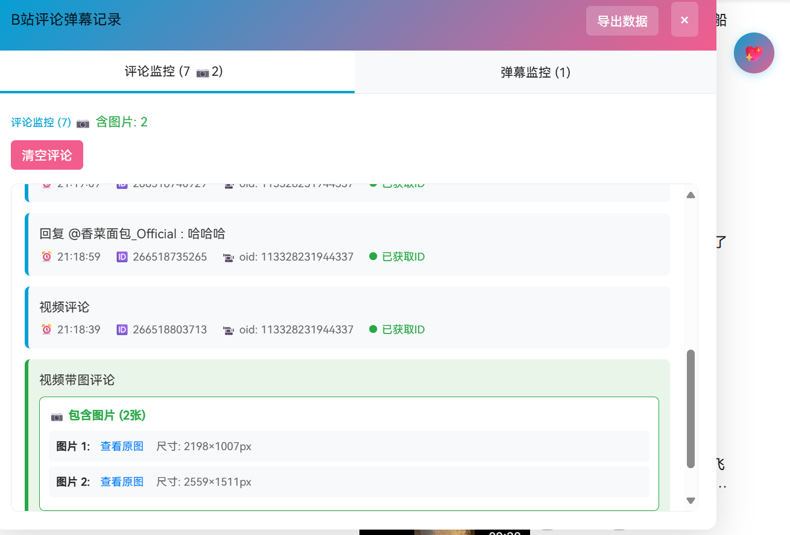
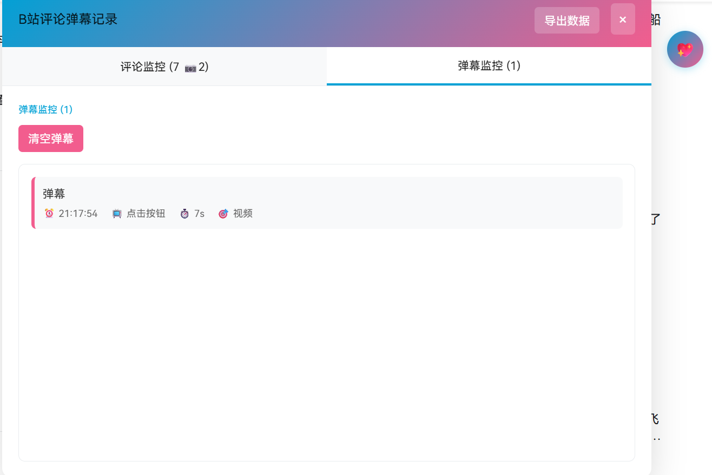

# B站评论弹幕监控助手

## 🫎安装

### 前置要求
1. 安装 [Tampermonkey](https://www.tampermonkey.net/) 或 [脚本猫](https://scriptcat.org/) 浏览器扩展

### 安装脚本
- **脚本猫**：[点击安装](https://scriptcat.org/scripts/脚本ID)
- **手动安装**：复制 `bili-monitor.js` 的内容到脚本管理器

## 🦕使用方法

1. 安装脚本后访问 [B站](https://www.bilibili.com)
2. 页面右侧会出现粉色悬浮球 
3. 点击悬浮球打开监控面板
4. 发送评论或弹幕后会自动记录
5. 点击"导出数据"可保存为JSON文件
6. 打开[评论清理工具](https://github.com/naaammme/bilibili-tools.git)的评论弹幕记录支持批量删除,跳转原视频
## 🐸截图

## 💖 致谢

- 感谢 [Bilibili](https://www.bilibili.com) 提供的平台

---
如果有用，请给个 ⭐ Star！